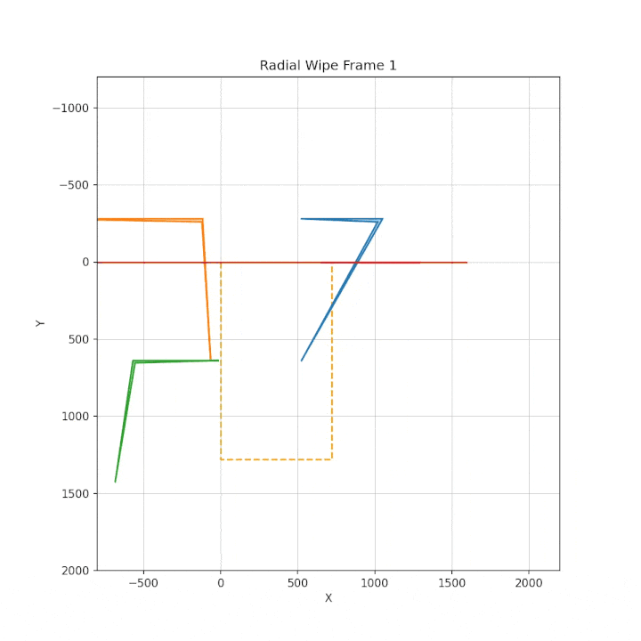
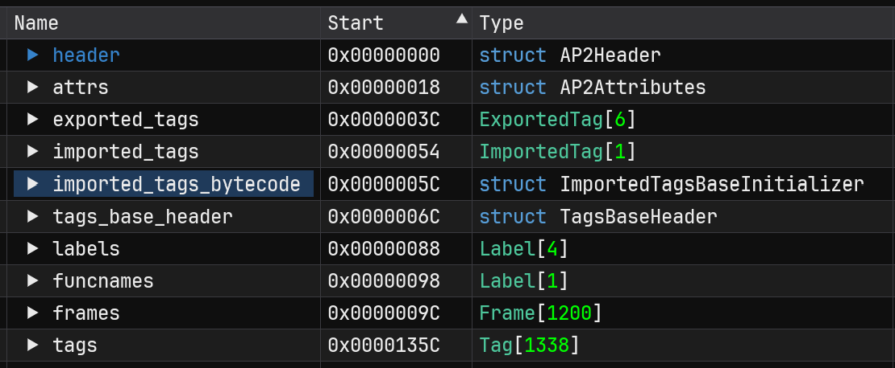

# AFP Format Specification
<!-- TOC -->
* [AFP Format Specification](#afp-format-specification)
  * [Introduction](#introduction)
  * [Obfuscation](#obfuscation)
  * [Data Types and Structures](#data-types-and-structures)
    * [enum AP2Tag](#enum-ap2tag)
    * [struct AP2Header](#struct-ap2header)
    * [struct AP2Attributes](#struct-ap2attributes)
    * [struct ExportedTag](#struct-exportedtag)
    * [struct NamedTagReference](#struct-namedtagreference)
    * [struct ImportedTag](#struct-importedtag)
    * [struct FrameBytecode](#struct-framebytecode)
    * [struct ImportedTagsBaseInitializer](#struct-importedtagsbaseinitializer)
    * [struct TagsBaseHeader](#struct-tagsbaseheader)
    * [struct Frame](#struct-frame)
    * [struct Label](#struct-label)
    * [struct Tag](#struct-tag)
    * [struct AP2ShapeTag](#struct-ap2shapetag)
    * [struct AP2ImageTag](#struct-ap2imagetag)
    * [struct Color_u8](#struct-coloru8)
    * [struct Color_u8_reversed](#struct-coloru8reversed)
    * [struct Color_s16](#struct-colors16)
    * [struct Point](#struct-point)
    * [struct HSL](#struct-hsl)
    * [struct AP2PlaceCameraTag](#struct-ap2placecameratag)
    * [struct AP2SpriteTag](#struct-ap2spritetag)
    * [struct AP2RemoveObjectTag](#struct-ap2removeobjecttag)
    * [struct EventData](#struct-eventdata)
    * [struct AP2DoAction](#struct-ap2doaction)
    * [struct AP2PlaceObjectTag](#struct-ap2placeobjecttag)
    * [Transition](#transition)
  * [AFP File Structure](#afp-file-structure)
    * [Tag Ordering](#tag-ordering)
  * [Playback](#playback)
<!-- TOC -->


## Introduction
This doc aims to serve as formal documentation for parsing an afp file, since it's only ever been documented in code so far.
This doc is based on the [Imhex pattern file](afp.hexpat) I wrote to parse a deobfuscated afp file for simplified viewing and minor 
editing. The pattern file is based on code in dragonminded's afputils. I won't cover details on some of the complicated 
aspects like blending or bytecode instructions, but you can find them in bemaniutils/afputils if you need to.

TL;DR it's still Flash at the fundamental level, but konami has turned it into their own proprietary format by making 
some subtle changes, and some not-so-subtle changes like hacking in 3D matrices and other things that the SWF format 
never supported. 

If you haven't read the bemaniutils/afputils README doc, that is the best place to start. I also suggest watching this 
[AFP Primer video](https://www.youtube.com/watch?v=DnjGjXpTysc) I made that goes over some basic stuff using examples in 
the Museca AFP Viewer, and how the game code controls the animations.


## Obfuscation
AFP files are obfuscated in two ways: The first 95% of the file is byteswapped and can be decoded with the matching BSI 
file, and the end of the file contains a string table that is obfuscated with a simple linear byte shift algorithm. I will 
leave the documentation of these up to the code in [decode_afp.py](decode_afp.py).  
Conveniently, the game does not require the file to be obfuscated, but it must have a blank BSI file at the least. This 
makes modifying and testing files very efficient. I've found that going into the test menu is enough to make the game 
reload the file from disk on the next time it gets called up, rather than having to restart the whole game.

## Data Types and Structures
- The file format is parsed in little-endian, except for bytecode sections, which uses big-endian.
- XY coordinates are stored as integers in a unit of measurement called a "twip", just like in SWF. A "twip" is 1/20th 
of a logical pixel, so you divide the integer by 20 to get the real value.
- Scale and rotate values are floats stored as fixed point values. Divide them by 1024 or 32768 depending on the flag.
- AFP does not use encoded integers or bit values from SWF.
- Many fields are only present if a flag is set. If there is no condition listed in the table, then the field should be parsed.
  If there is a condition and the condition is false, the field should be skipped. 

### enum AP2Tag
Every tag found in an AFP file. The majority of these are identical to tag in the SWF file specification but are not seen 
in practice. Konami added their own AP2 tags onto the end of the table.

| Tag ID | Tag Name                |
|--------|-------------------------|
| 0x0    | SHOW_FRAME              |
| 0x1    | DEFINE_SHAPE            |
| 0x2    | PLACE_OBJECT            |
| 0x4    | REMOVE_OBJECT           |
| 0x5    | DEFINE_BITS             |
| 0x6    | DEFINE_BUTTON           |
| 0x7    | JPEG_TABLES             |
| 0x8    | BACKGROUND_COLOR        |
| 0x9    | DEFINE_FONT             |
| 0xA    | DEFINE_TEXT             |
| 0xB    | DO_ACTION               |
| 0xC    | DEFINE_FONT_INFO        |
| 0xD    | DEFINE_SOUND            |
| 0xE    | START_SOUND             |
| 0xF    | DEFINE_BUTTON_SOUND     |
| 0x11   | SOUND_STREAM_HEAD       |
| 0x12   | SOUND_STREAM_BLOCK      |
| 0x13   | DEFINE_BITS_LOSSLESS    |
| 0x14   | DEFINE_BITS_JPEG2       |
| 0x15   | DEFINE_SHAPE2           |
| 0x16   | DEFINE_BUTTON_CXFORM    |
| 0x17   | PROTECT                 |
| 0x18   | PLACE_OBJECT2           |
| 0x1A   | REMOVE_OBJECT2          |
| 0x1C   | DEFINE_SHAPE3           |
| 0x20   | DEFINE_TEXT2            |
| 0x21   | DEFINE_BUTTON2          |
| 0x22   | DEFINE_BITS_JPEG3       |
| 0x23   | DEFINE_BITS_LOSSLESS2   |
| 0x24   | DEFINE_EDIT_TEXT        |
| 0x25   | DEFINE_SPRITE           |
| 0x27   | FRAME_LABEL             |
| 0x2B   | SOUND_STREAM_HEAD2      |
| 0x2D   | DEFINE_MORPH_SHAPE      |
| 0x2E   | DEFINE_FONT2            |
| 0x30   | EXPORT_ASSETS           |
| 0x38   | IMPORT_ASSETS           |
| 0x39   | DO_INIT_ACTION          |
| 0x3B   | DEFINE_VIDEO_STREAM     |
| 0x3C   | VIDEO_FRAME             |
| 0x3D   | DEFINE_FONT_INFO2       |
| 0x3E   | ENABLE_DEBUGGER2        |
| 0x40   | SCRIPT_LIMITS           |
| 0x41   | SET_TAB_INDEX           |
| 0x42   | PLACE_OBJECT3           |
| 0x46   | IMPORT_ASSETS2          |
| 0x47   | DEFINE_FONT3            |
| 0x4B   | METADATA                |
| 0x4D   | DEFINE_SCALING_GRID     |
| 0x4E   | DEFINE_SHAPE4           |
| 0x53   | DEFINE_MORPH_SHAPE2     |
| 0x54   | SCENE_LABEL             |
| 0x56   | AFP_IMAGE               |
| 0x64   | AFP_DEFINE_SOUND        |
| 0x65   | AFP_SOUND_STREAM_BLOCK  |
| 0x66   | AFP_DEFINE_FONT         |
| 0x67   | AFP_DEFINE_SHAPE        |
| 0x68   | AEP_PLACE_OBJECT        |
| 0x6E   | AP2_DEFINE_FONT         |
| 0x78   | AP2_DEFINE_SPRITE       |
| 0x79   | AP2_DO_ACTION           |
| 0x7A   | AP2_DEFINE_BUTTON       |
| 0x7B   | AP2_DEFINE_BUTTON_SOUND |
| 0x7C   | AP2_DEFINE_TEXT         |
| 0x7D   | AP2_DEFINE_EDIT_TEXT    |
| 0x7E   | AP2_PLACE_OBJECT        |
| 0x7F   | AP2_REMOVE_OBJECT       |
| 0x80   | AP2_START_SOUND         |
| 0x81   | AP2_DEFINE_MORPH_SHAPE  |
| 0x82   | AP2_IMAGE               |
| 0x83   | AP2_SHAPE               |
| 0x84   | AP2_SOUND               |
| 0x85   | AP2_VIDEO               |
| 0x86   | AP2_PLACE_CAMERA        |
| 0x88   | AP2_SCALING_GRID        |
| 0x89   | END                     |

### struct AP2Header
The header section at the top of the afp file. The flags are not fully understood. Some determine what is parsed in the 
AP2Attributes struct. Flags & 0x8 seems to disable the AP2_DO_ACTION tags. 

| Field      | Type    | Comment                                                                                                                      |
|------------|---------|------------------------------------------------------------------------------------------------------------------------------|
| magic      | char[4] | First byte is the version id. The whole thing can be decoded to AP2 by reading in little endian and & 0x7f7f7f00.            |
| length     | u32     | The total file length.                                                                                                       |
| version    | u16     | Some kind of version relating to tag parsing. Modern afp libs only accept 0x200.                                             |
| nameoffset | u16     | Relative to string table. Usually the first string in the table, this is the name of the file/movie.                         |
| flags      | u32     | Not all bits known. 0x1 and 0x3 determine the presence of some fields in AP2Attributes. 0x8 seems to disable AP2Action tags. |
| left       | u16     | Composition bounding box.                                                                                                    |
| right      | u16     |                                                                                                                              |
| top        | u16     |                                                                                                                              |
| bottom     | u16     |                                                                                                                              |

### struct AP2Attributes
Follows the AP2Header. Contains some more information about the composition as well as absolute offsets for the main sections 
of the file.

| Field                            | Type         | Condition          | Comment                                               |
|----------------------------------|--------------|--------------------|-------------------------------------------------------|
| fps                              | s32 or float | --------------->   | Value / 1024 if (header.flags & 0x2) else Float       |
| bg_color                         | Color_u8     | header.flags & 0x1 | Not rendered in-game.                                 |
| num_exported_assets              | u16          |                    | The number of exported movie clips.                   |
| imported_tags_count              | s16          |                    | Usually 1 for "aeplib". Functionality unknown.        |
| tags_base_offset                 | u32          |                    | Absolute offset of the tags_base_header section.      |
| exported_tags_offset             | u32          |                    | Absolute offset of the exported_tags section.         |
| imported_tags_offset             | u32          |                    | Absolute offset of the imported_tags section.         |
| stringtable_offset               | u32          |                    | Absolute offset of the string table.                  |
| stringtable_size                 | u32          |                    |                                                       |
| imported_tag_initializers_offset | u32          | header.flags & 0x4 | Absolute offset of the imported_tags_bytecode section |

### struct ExportedTag
Exported tags are objects that have been flagged for export. In flash animation, this makes them available for import by 
other SWF animations. In konami animation, this is really only seen on sprites, and it just exports them to the afp folder. 
The games generally only load the main movie clips (sometimes labeled "_all"), but the exported assets are nonetheless 
available for inspecting in the AFP Viewer scene. 

| Field               | Type | Comment                         |
|---------------------|------|---------------------------------|
| asset_tag_id        | u16  | Sprite ID                       |
| asset_string_offset | u16  | Relative offset to string table |

### struct NamedTagReference
Created only for handling imported tags.

| Field               | Type | Comment                         |
|---------------------|------|---------------------------------|
| asset_tag_id        | u16  |                                 |
| asset_string_offset | u16  | Relative offset to string table |

### struct ImportedTag
I suppose it's possible for afp files to import other afp files, but I've never seen this in practice. There usually seems 
to be a single "aeplib" import reference at least, but I'm not sure what it does.

| Field               | Type                     | Comment                         |
|---------------------|--------------------------|---------------------------------|
| asset_string_offset | u16                      | Relative offset to string table |
| count               | u16                      |                                 |
| named_tagRefs       | NamedTagReference[count] |                                 |

### struct FrameBytecode
This appears to be bytecode to execute on a per-frame basis. We execute this every frame and
only execute up to the point where we equal the current frame.  
If action_bytecode_length > 0, the bytecode can be found at  attrs.imported_tag_initializers_offset + action_bytecode_offset.

| Field                  | Type | Comment                                                    |
|------------------------|------|------------------------------------------------------------|
| tag_id                 | u16  |                                                            |
| frame                  | u16  |                                                            |
| action_bytecode_offset | u32  | Relative to AP2Attributes.imported_tag_initializers_offset |
| action_bytecode_length | u32  |                                                            |

### struct ImportedTagsBaseInitializer
Bytecode to execute on a per-frame basis. We execute this every frame and only execute up to the point where we equal the 
current frame.

| Field          | Type                 | Comment                 |
|----------------|----------------------|-------------------------|
| unk1           | u16                  |                         |
| count          | u16                  |                         |
| frame_bytecode | FrameBytecode[count] | Imported tags bytecode. |

### struct TagsBaseHeader
A header used in the root clip and in sprites. Contains information for parsing a movie clip/sprite.  
All offsets are relative to the start of this header object. 

| Field                | Type | Condition                | Comment                                               |
|----------------------|------|--------------------------|-------------------------------------------------------|
| name_reference_flags | u16  |                          | This is 4 if there are funcnames in the string table. |
| frame_label_count    | u16  |                          |                                                       |
| frame_count          | u32  |                          |                                                       |
| tags_count           | u32  |                          | The number of tags in the root clip.                  |
| frame_labels_offset  | u32  |                          | Relative to the start of this header object.          |
| frames_offset        | u32  |                          | Relative to the start of this header object.          |
| tags_offset          | u32  |                          | Relative to the start of this header object.          |
| funcname_count       | u16  | name_reference_flags & 4 |                                                       |

### struct Frame
| Field      | Type | Comment                                                                       |
|------------|------|-------------------------------------------------------------------------------|
| frame_info | u32  | A packed value containing a start tag index and the number of frames to play. |
|            |      | start_tag_offset = frame_info & 0xFFFFF;                                      |
|            |      | num_tags_to_play = (frame_info >> 20) & 0xFFF;                                |

### struct Label
Konami's version of the FrameLabel tag. It gives a specified name or action to the current frame.   
Some common label names include "in", "loop", "out", and "out_end". The root movie clip and child sprites with refnames 
usually have these labels so the game can set them all at the same time.  
Some common action names (funcnames) include "gotoAndPlay", "loop", and "stop". 

| Field        | Type | Comment                                          |
|--------------|------|--------------------------------------------------|
| frameno      | u16  | The frame number that this label is attached to. |
| stringoffset | u16  | Relative offset to string table.                 |

### struct Tag
Each tag begins with a tagtype and length. This is similar to an SWF RecordHeader, but konami made their own 
in-between version of the two SWF options.  
The upper 10 bits are the tag type, and the lower 22 bits are the length. The maximum tag length supported is about 4MB.
I'm not sure if there's a version of this header that supports longer tags like in SWF.  

The length specified in the tag_header does not include the tag_header itself.  

The tag data immediately follows the tag header, so in a way this is a parent class for tags. In the imhex pattern file, 
this struct handles assigning the correct tag type struct to the data following the tag header.

| Field      | Type | Comment                               |
|------------|------|---------------------------------------|
| tag_header | u32  | tagtype = (tag_header >> 22) & 0x3FF; |
|            |      | length = tag_header & 0x3FFFFF;       |

### struct AP2ShapeTag
The shape tag creates a reference to a geo file in the format of `{rootClip.name}_shape{shape_id}`. The geo file 
defines either a solid color rectangle or a texture quad. In the case of a texture quad, the geo file will have a 
texture filename string. See the bemaniutils/afputils README and geo.py for more information.  

Shapes seem to be the primary means of loading textures in the game, and often assgined to a double-nested sprite with 
1 tag that places the previous object. You will often see this strange pattern and I'm not sure what the reason or purpose is:   
```
AP2_SHAPE: id:4
AP2_DEFINE_SPRITE: id:5 (1 tag: place object id 4)
AP2_DEFINE_SPRITE: id:6 (1 tag: place object id 5) // This is the object that gets placed.
```

| Field | Type | Comment                                                                                                          |
|-------|------|------------------------------------------------------------------------------------------------------------------|
| flags | u16  | In museca at least, 0x2 seems to be set if the shape has a texture mapped to it.                                 |
| id    | u16  | The object id assigned to this shape, which is also used in the shape's filename in the geo folder or TXP2 file. |

### struct AP2ImageTag
Image tags contain a texture reference that the afp library can use to load the texture directly.  
I've seen this used in museca a few times, but sometimes at the exact same location as a sprite with the same texture. 
Disabling the image didn't affect the render, so I'm not really sure what the purpose was. For the most part, images are
assigned to shapes, and often assgined to a double-nested sprite with 1 tag that places the previous object.

| Field        | Type | Comment                         |
|--------------|------|---------------------------------|
| flags        | u32  |                                 |
| id           | u16  | Object id                       |
| stringoffset | u16  | Relative offset to string table |

### struct Color_u8
| Field | Type | Comment |
|-------|------|---------|
| r     | u8   |         |
| g     | u8   |         |
| b     | u8   |         |
| a     | u8   |         |

### struct Color_u8_reversed
| Field | Type | Comment |
|-------|------|---------|
| a     | u8   |         |
| b     | u8   |         |
| g     | u8   |         |
| r     | u8   |         |

### struct Color_s16
| Field | Type | Comment |
|-------|------|---------|
| r     | s16  |         |
| g     | s16  |         |
| b     | s16  |         |
| a     | s16  |         |


### struct Point
| Field | Type | Comment         |
|-------|------|-----------------|
| x     | s32  | Divide by 20.0  |
| y     | s32  | Divide by 20.0  |
| z     | s32  | Divide by 20.0  |

### struct HSL
Hue/Lightness/Saturation shift, matching after effects in the limits.

| Field      | Type | Comment         |
|------------|------|-----------------|
| hue        | s16  | Divide by 360.0 |
| saturation | s8   | Divide by 100.0 |
| lightness  | s8   | Divide by 100.0 |

### struct AP2PlaceCameraTag
Defines a camera by specifying the location and distance to the render plane in 3D space. The camera always looks straight
down at the canvas and the focal length, in practice, always matches the Z offset of the camera. This is only used in 
conjunction with objects that have a perspective transform to correctly render the object based on its depth in the Z plane.

| Field        | Type  | Condition   | Comment                                                                 |
|--------------|-------|-------------|-------------------------------------------------------------------------|
| flags        | u16   |             |                                                                         |
| camera_id    | u16   |             |                                                                         |
| center       | Point | flags & 0x1 | The camera's X/Y/Z position in the scene, looking "down" at the canvas. |
| focal_length | s32   | flags & 0x2 | The focal length of the camera, used to construct the FOV.              |

### struct AP2SpriteTag
Defines a sprite object, which is essentially an embedded movie clip. It contains many of the same objects found at the root
of the main movie clip in a similar order. It has its own timeline that can be controlled independently of the main timeline.

| Field               | Type                                                                                      | Condition   | Comment                                                                                                                                              |
|---------------------|-------------------------------------------------------------------------------------------|-------------|------------------------------------------------------------------------------------------------------------------------------------------------------|
| flags               | u16                                                                                       |             |                                                                                                                                                      |
| sprite_id           | u16                                                                                       |             | Object id                                                                                                                                            |
| subtags_offset      | u32                                                                                       | flags & 0x1 | Not sure if this offset is really even necessary.                                                                                                    |
| subtags_base_header | TagsBaseHeader                                                                            |             |                                                                                                                                                      |
| frames              | Frame[subtags_base_header.frame_count] @ subtags_base_header.frames_offset                |             | * Relative to TagsBaseHeader                                                                                                                         |
| subtags             | Tag[subtags_base_header.tags_counnt] @ subtags_base_header.tags_offset                    |             | * Relative to TagsBaseHeader                                                                                                                         |
| labels              | Label[subtags_base_header.frame_label_count] @ subtags_base_header.frame_labels_offset    |             | * Relative to TagsBaseHeader                                                                                                                         |
| funcnames           | Label[subtags_base_header.funcname_count] @ (frame_label_count * 4) + frame_labels_offset |             | * Relative to TagsBaseHeader. This doesn't have an offset defined in the tagsbaseheader, but it always seems to follow right after the frame labels. |


### struct AP2RemoveObjectTag
Removes object id from the canvas at the specified depth.

| Field        | Type | Comment |
|--------------|------|---------|
| object_id    | u16  |         |
| depth        | u16  |         |

### struct EventData
Event triggers found within an AP2_PLACE_OBJECT tag. Some event triggers include ON_LOAD, ON_ENTER_FRAME, ON_UNLOAD, mouse
and key movements and rollovers, followed by compiled bytecode similar to AS3 used for setting masks, toggling visibility, rewind/advance, etc. 
See bemaniutils/swf.py and decompile.py for parsing details.

| Field    | Type           | Comment            |
|----------|----------------|--------------------|
| flags    | u32            |                    |
| length   | u32            |                    |
| bytecode | char[length]   | Compiled bytecode. |

### struct AP2DoAction
Compiled bytecode similar to AS3 used for setting masks, toggling visibility, rewind/advance, looping, etc.
See bemaniutils/swf.py and decompile.py for parsing details.

| Field      | Type             | Comment             |
|------------|------------------|---------------------|
| bytecode   | char[tag_length] | Compiled bytecode.  |

### struct AP2PlaceObjectTag
Behold: Konami's mighty, all-in-one Place Object tag. Complete with obviously hacked-in features that flash doesn't natively support
such as 3D transformations and transition/masking effects. Members that appear more than once in this table should only be assigned as 
one or the other, not both. Not all flags are fully understood.  
Places an object at the specified depth. Only one object can exist at each depth, but the same object can be placed multiple
times at different depths.

| Field        | Type              | Condition             | Comment                                                                                                                                                  |
|--------------|-------------------|-----------------------|----------------------------------------------------------------------------------------------------------------------------------------------------------|
| flags1       | u32               |                       |                                                                                                                                                          |
| depth        | u16               |                       |                                                                                                                                                          |
| object_id    | u16               |                       |                                                                                                                                                          |
| flags2       | u32               | flags1 & 0x8_000_000  |                                                                                                                                                          |
| src_tag_id   | u16               | flags1 & 0x2          | Has a shape or movie component. This id references an already created object.                                                                            |
| label_id     | u16               | flags1 & 0x10         | Has a label component.                                                                                                                                   |
| name_offset  | u16               | flags1 & 0x20         | Has a movie name reference. This name is often used by the game to get the instance of this object.                                                      |
| unk3         | u16               | flags1 & 0x40         |                                                                                                                                                          |
| blend        | u8                | flags1 & 0x20_000     | Has blend component.                                                                                                                                     |
| ALIGN<4>     |                   |                       | Due to possible misalignment, we need to realign.                                                                                                        |
| matrix_a     | s32               | flags1 & 0x100        | Has scale component. Div by 1024.                                                                                                                        |
| matrix_d     | s32               | follows previous      |                                                                                                                                                          |
| matrix_b     | s32               | flags1 & 0x200        | Has a rotate component. Div by 1024.                                                                                                                     |
| matrix_c     | s32               | follows previous      |                                                                                                                                                          |
| matrix_tx    | s32               | flags1 & 0x400        | Has translate component. Div by 20.                                                                                                                      |
| matrix_ty    | s32               | follows previous      |                                                                                                                                                          |
| mult_color   | Color_s16         | flags1 & 0x800        | Multiplicative color present.                                                                                                                            |
| add_color    | Color_s16         | flags1 & 0x1000       | Additive color present.                                                                                                                                  |
| mult_color   | Color_u8_reversed | flags1 & 0x2000       | Multiplicative color present, smaller integers.                                                                                                          |
| add_color    | Color_u8_reversed | flags1 & 0x4000       | Additive color present, smaller integers.                                                                                                                |
| event_data   | EventData         | flags1 & 0x80         | Bytecode similar to AS3.                                                                                                                                 |
| filter_count | u16               | flags1 & 0x10_000     | Unknown filter data.                                                                                                                                     |
| filter_size  | u16               | follows previous      | Unknown filter data.                                                                                                                                     |
| rot_origin_x | s32               | flags1 & 0x1_000_000  | Rotation origin XY. Div by 20.                                                                                                                           |
| rot_origin_y | s32               | follows previous      |                                                                                                                                                          |
| rot_origin_z | s32               | flags2 & 0x2          | Rotation origin Z. Div by 20.                                                                                                                            |
| -----        | ------            | flags1 & 0x2_000_000  | Instruction to set previously read rotation origins to 0. There is no data to be read.                                                                   |
| matrix_a     | s16               | flags1 & 0x40_000     | An alternative method for populating transform scaling. Appears in iidx and museca. Div by 32768.                                                        |
| matrix_d     | s16               | follows previous      | Div by 32768.                                                                                                                                            |
| matrix_b     | s16               | flags1 & 0x80_000     | Div by 32768.                                                                                                                                            |
| matrix_c     | s16               | follows previous      | Div by 32768.                                                                                                                                            |
| unk_4        | u16               | flags1 & 0x100_000    | Some unknown short.                                                                                                                                      |
| ALIGN<4>     |                   |                       | Due to possible misalignment, we need to realign.                                                                                                        |
| transform_tz | s32               | flags1 & 0x8_000_000  | Translation offset "z" for a 3D transform matrix. Div by 20.                                                                                             |
| transform_3D | s32[9]            | flags1 & 0x10_000_000 | A 3x3 grid of initializers for a 3D transform matrix. See bemaniutils/swf.py for details.                                                                |
| hsl          | HSL               | flags1 & 0x20_000_000 | Hue, saturation, lightness.                                                                                                                              |
|              |                   | flags2 & 0x4          | RAISE EXCEPTION: UNKNOWN/UNHANDLED                                                                                                                       |
| transition   | Transition        | flags2 & 0x8          | This is a hacked-in effect for applying animated masks such as radial or linear wipes to the object.                                                     |
| ap2_image_1  | u32, s16, s16     | flags2 & 0x10         | Haven't come across this yet. The two shorts are the same var as in flags2 & 0x20 though.                                                                |
| ap2_image_2  | u16, s16, s16     | flags2 & 0x20         | Appears to be referencing the ifs texture canvas, with short 1 referencing an AP2_IMAGE_TAG id, and the next 2 shorts being the uv size of that texture. |
| ALIGN<4>     |                   |                       | Due to possible misalignment, we need to realign.                                                                                                        |
|              |                   | flags2 & 0x40         | RAISE EXCEPTION: UNKNOWN/UNHANDLED                                                                                                                       |
| -----        | -----             | flags1 & 0x1          | True if updating an already placed object.                                                                                                               |
| -----        | -----             | flags1 & 0x4          | Use transform matrix - These 3 flags are used by the renderer. They are implicitly enabled if the data for them exists.                                  |
| -----        | -----             | flags1 & 0x8          | Use color information                                                                                                                                    |
| -----        | -----             | flags1 & 0x4_000_000  | Use 3D Perspective transform system, else use 2D transform.                                                                                              |


### Transition
This is a hacked-in effect for applying animated masks such as radial or linear wipes to the object. Flash authoring applications
do not way have to create these effects, nor are they supported by the swf format. After Effects  *can* create these effects—they 
are called Transitions—but they must be rasterized to images before exporting to SWF because the format doesn't support it, so I'm 
not sure how they created them unless they just wrote their own program to generate it and merged it in during the afp conversion 
process, or perhaps they made their own AE plugin.

That said, from what I've seen of its usage in museca, it's a system that creates a shape from XY coordinate pairs and applies
it to the object as a mask. A bitmask int at the start of the object indicates how many chunks there are to parse. The flag parsing
seems to indicate that more than simple X/Y coordinate pairs or quads are supported, perhaps an effect like an iris wipe
that requires more coordinates? I have yet to see any examples other than linear and radial though.
The format is too complicated for a markdown table, so I will notate it below. 

        u32 bitmask; // each bit represents one chunk to parse.
        for bit in range(32):
            if bool(bitmask & (1 << bit)):
                u16 unk_flags, coord_count; // read 2 shorts

            short_count = (
                # Either 2 or 6, depending on unk_flags & 0x10 set.
                (((unk_flags & 0x10) | 0x8) >> 2)
                *
                # Either 1 or 2, depending on unk_flags & 0x1 set.
                # Seems to indicate whether there are 1 or 2 quads in this segment?
                ((unk_flags & 1) + 1)
                *
                # Count read from the header above.
                coord_count maybe?
            )

            s16 coords[short_count]; // Read x amount of signed shorts. These are expressed in 
                                     // twips, so divide them by 20 to get the real coordinate.

Below is an example of the radial wipe from museca's title screen. The first frame appears to create 5 quads, though only 
one of them is inside the display area. The 4th chunk has flag 1 set, so there are 8 coordinate pairs in the chunk, but every
Y coordinate is 0 so it seems to create a flat line that does nothing.  
The quads also appear to be optimized in a way that they try to create a new quad at every 90 degree angle reached. Otherwise,
it continues morphing the shape past 90 degrees, as seen in the 4th quad around frame 22. It even masks beyond the start angle 
to ensure the image is fully revealed.




## AFP File Structure
The beginning of an AFP file starts with the [AP2Header](#struct-ap2header) struct. Following that is an [AP2Attributes](#struct-ap2attributes) 
struct that contains absolute offsets for parsing the exported_tags, imported_tags, imported_tags_bytecode, and 
tags_base_header sections. 
The [tags_base_header](#struct-tagsbaseheader) contains relative offsets for parsing the rest of the file.  
At the end of the file is a string table that any structure in the file can reference. All strings in the file are stored
here. 



Programmatically, this is how the file is parsed in the [imhex pattern file](afp.hexpat), with $ representing the current position:
```
AP2Header header @ 0x00;
AP2Attributes attrs @ $;
ExportedTag exported_tags[attrs.num_exported_assets] @ attrs.exported_tags_offset;
ImportedTag imported_tags[attrs.imported_tags_count] @ attrs.imported_tags_offset;
ImportedTagsBaseInitializer imported_tags_bytecode @ attrs.imported_tag_initializers_offset;

TagsBaseHeader tags_base_header @ attrs.tags_base_offset;
Label labels[tags_base_header.frame_label_count] @ attrs.tags_base_offset + tags_base_header.frame_labels_offset;
u32 funcnames_offset = attrs.tags_base_offset + tags_base_header.frame_labels_offset + (tags_base_header.frame_label_count * 4);
Label funcnames[tags_base_header.funcname_count] @ funcnames_offset;
Frame frames[tags_base_header.frame_count] @ attrs.tags_base_offset + tags_base_header.frame_offset;
Tag tags[tags_base_header.tags_count] @ attrs.tags_base_offset + tags_base_header.tags_offset;


```

With imhex structs, you can use if/else statements directly in the struct definition. This makes it easy to build 
variable-sized structures with many conditions involved. The Tag struct handles assigning the tag type struct that follows 
each tag header. 

### Tag Ordering
There are two main categories of tags:
- Definition tags, which define the objects to be used in the file — Shapes, Sprites, Images, etc.
- Control tags, which place objects or perform actions that affect the rendering and playback.  

In a tag list, definition tags will always come before control tags. This is likely to build a dictionary of objects in 
the afp library before playback starts, much like SWF, but also because a control tag cannot reference an object that has
not yet been defined. Therefore, all objects must be defined before any action that depends on them can be performed.

Unlike SWF, there is no END tag at the end of the file. 

## Playback
The way AFP files are played highlights a key difference between AFP and SWF. The frames of an SWF file are determined 
by the ShowFrame tags that appear after placing, modifying or removing objects on the canvas. All tags are processed until 
a ShowFrame tag is encountered, at which point the contents of the display list is rendered to the screen, and the process 
continues until an END tag is reached.  
AFP files do not use ShowFrame tags or End tags, rather they have a list of [Frame](#struct-frame) objects that tell the 
playback engine how many tags to play and where to start playing them. This creates the display list, which is then presumably 
rendered to the screen after all tags in the frame are processed. When the last frame is played, the animation loops back 
to the start and continues playing automatically unless stopped by a DoAction tag. This seems to be the default behavior 
in the afp playback engine at least.  
And just like SWF, the contents of any frame's display list includes the accumulation of all the frames before it. This 
makes it possible to loop and jump to frame labels. 
