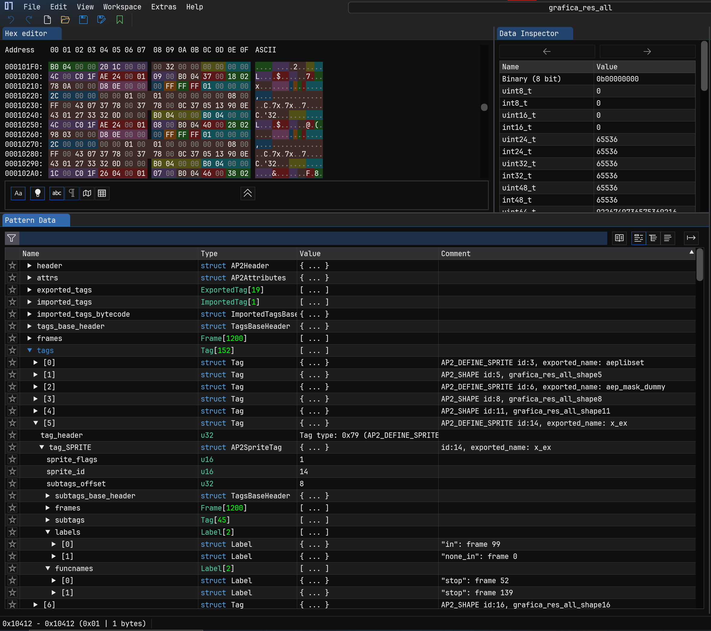
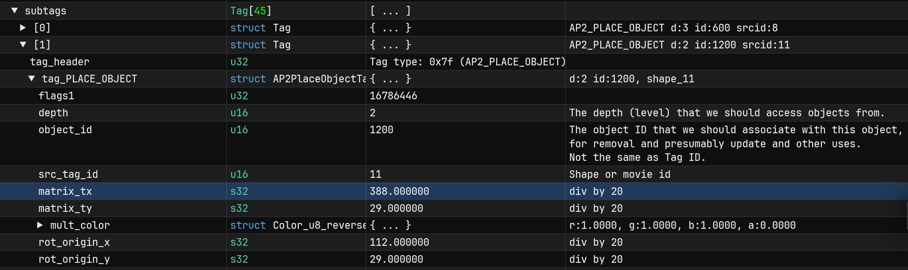

# afptools
This is a reupload of windyfairy's afptools with a new pattern file for ImHex and a couple of other minor tweaks.
The pattern file afp format is based on dragonminded's bemaniutils/afputils code.  

By decoding the afp/bsi pair with decode_afp.py and then feeding it into ImHex with the afp pattern, you can browse and
even make minor edits to fields like translate or scale with ease. Furthermore, the game can handle a fully unobfuscated
afp file so long as you provide a blank bsi file of the same name.

  

Matrix fields require some division to get the actual coordinate, but the imhex pattern does it automatically! It will 
format the number on read and write, no manual calculation required.

